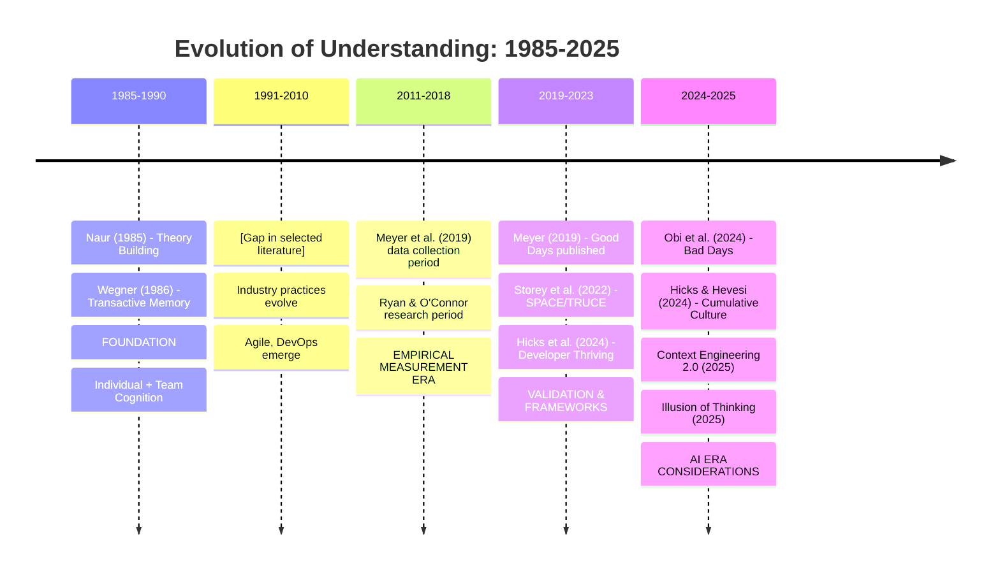
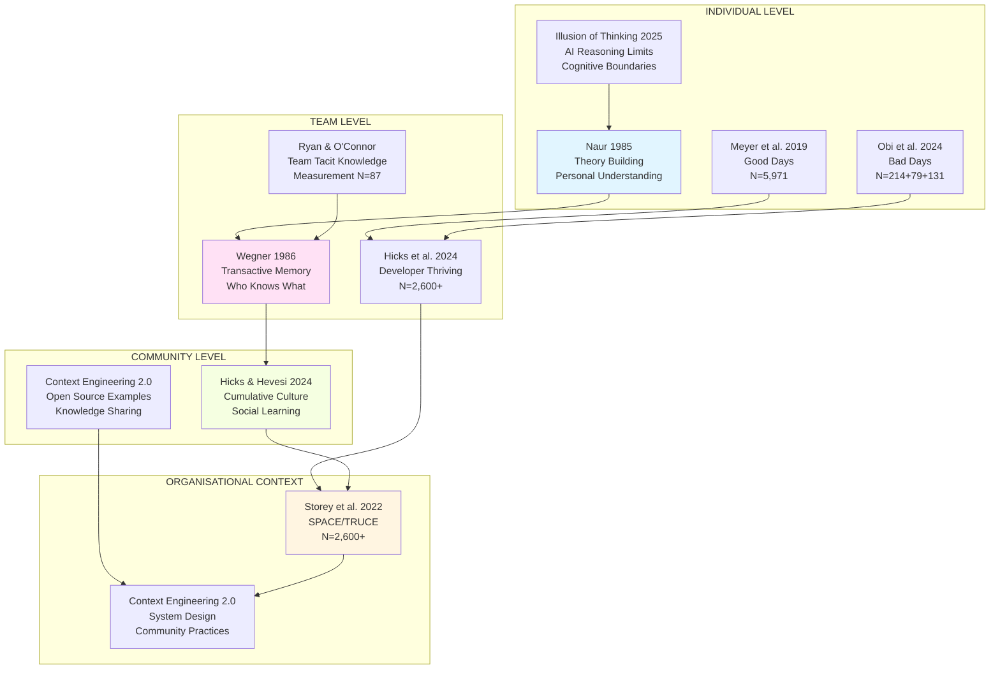
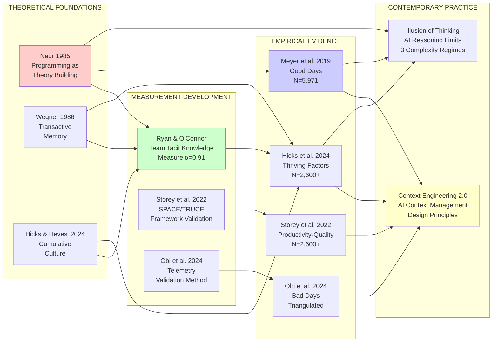
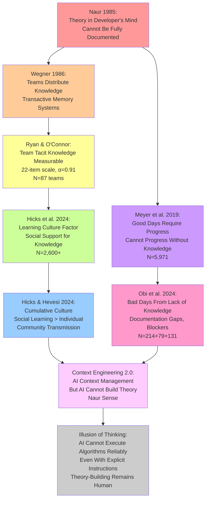
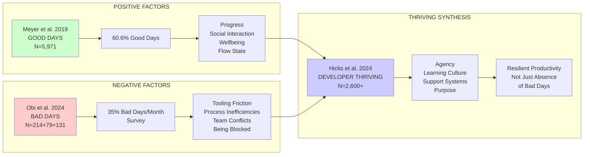
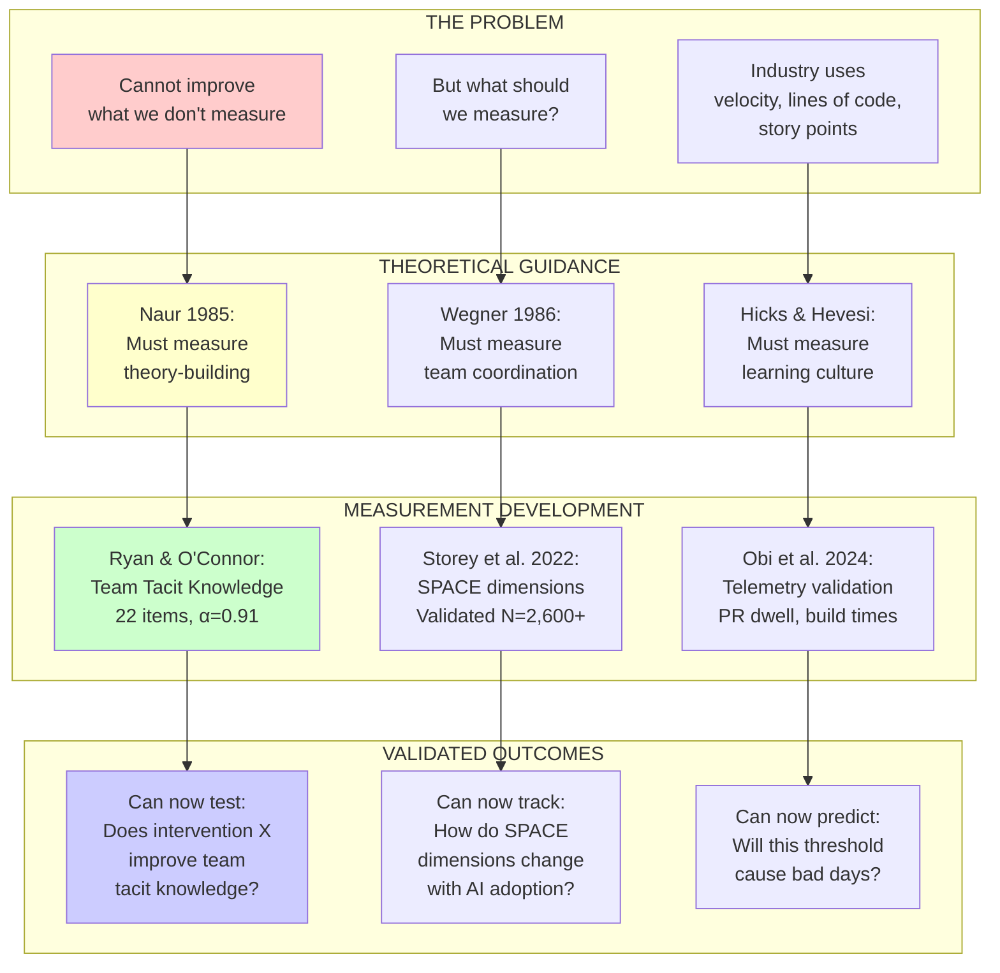
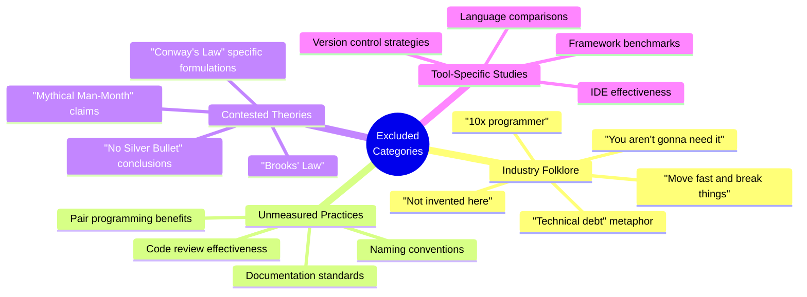
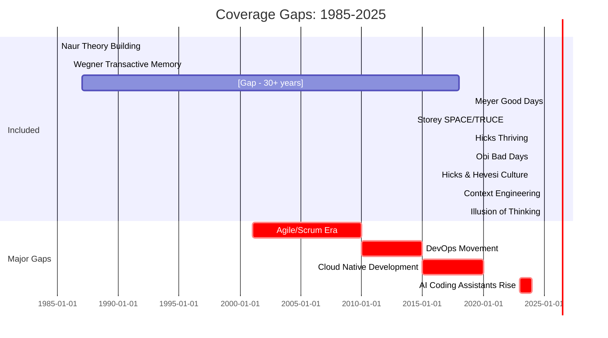
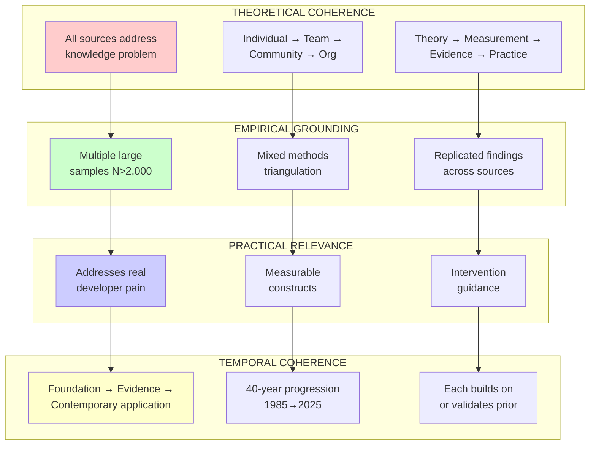

# Framework Integration Architecture: Understanding the Knowledge Base

## Executive Summary

This document explains how ten carefully selected academic sources, spanning 1985 to 2025, form a coherent foundation for understanding AI-augmented software development. These sources were chosen not for their popularity or influence in industry discourse, but for their empirical rigour, theoretical coherence, and ability to bridge individual cognition, team dynamics, and organisational contexts. 

The selection deliberately prioritises peer-reviewed research and theoretically grounded frameworks over industry folklore—even when that folklore has been highly influential. This choice reflects a fundamental principle: **influence and validity are orthogonal concerns**. A concept can be widely adopted yet empirically unsupported (e.g., "10x programmer"), or rigorously validated yet underutilised in practice (e.g., transactive memory theory in software teams).

---

## Selection Rationale: Rigour Over Influence

### The Problem of Industry Folklore

Software development has been shaped by numerous influential concepts that lack empirical grounding:

**Influential but Unsupported:**
- "Move fast and break things" (Zuckerberg/Facebook) - High influence, likely negative outcomes
- "10x programmer" myth - Widely referenced, empirically contested
- "Not invented here" syndrome - Assumed universal, context-dependent
- "Technical debt" metaphor - Useful framing, rarely measured rigorously
- "You aren't gonna need it" (YAGNI) - Practical heuristic, domain-specific validity

**Why These Were Excluded:**
1. **Lack of empirical validation**: Claims not systematically tested
2. **Contextual limitations**: What works in one setting may fail in others
3. **Measurement challenges**: Outcomes rarely quantified
4. **Confounding factors**: Success may derive from other variables
5. **Survivorship bias**: We hear about successes, not silent failures

### The Selection Criteria

Each of the ten included sources meets multiple criteria:

**Essential Criteria:**
1. **Theoretical coherence**: Clear conceptual framework or well-defined constructs
2. **Empirical grounding**: Either presents data or synthesises validated evidence
3. **Methodological transparency**: Approach clearly documented and replicable
4. **Generalisability potential**: Findings applicable beyond narrow contexts
5. **Conceptual contribution**: Adds distinct insight not available elsewhere

**Quality Indicators:**
- Peer review or equivalent validation process (7/10 peer-reviewed)
- Large sample sizes where applicable (N>2,000 in multiple studies)
- Triangulation across methods (mixed-methods studies valued)
- Longitudinal or cross-sectional depth
- Citation in subsequent research (established influence in scholarship)

**What This Means:**
We prioritise sources that can be wrong in ways we can detect and correct, over sources that feel intuitively right but cannot be tested. The goal is **falsifiable knowledge** rather than **appealing narratives**.

---

## Conceptual Architecture: Three Integrated Perspectives

The ten sources form a coherent whole when viewed through three overlapping lenses:

### 1. Temporal Progression: Knowledge Accumulation (1985→2025)

**Why This Timeline Matters:**

**1985-1990: Foundational Theory**
- Naur (1985): Established that programming is fundamentally cognitive work involving theory-building
- Wegner (1986): Showed teams distribute knowledge through transactive memory
- These remained largely disconnected from mainstream SE for decades

**The Missing Middle (1991-2018):**
- Industry developed practices (Agile, Scrum, DevOps) based largely on experience
- Academic SE research focused heavily on tools, processes, defects
- Human factors research existed but remained siloed
- **Consequence**: Practice evolved separately from cognitive science foundations

**2019-2023: Empirical Renaissance**
- Large-scale quantitative studies become feasible (N>2,000)
- Developer experience emerges as legitimate research area
- Frameworks (DORA, SPACE) gain traction
- **Connection**: Finally linking Naur's insights to measurable outcomes

**2024-2025: AI Integration Challenge**
- Rapid AI adoption creates urgency
- Need to understand human-AI collaboration
- Cumulative culture lens becomes relevant
- AI limitations require documentation
- **Current moment**: Must integrate 40 years of knowledge quickly

### 2. Analytical Levels: Nested Contexts

**Why Nested Levels Matter:**

**Individual Level (Naur, Meyer, Obi, Illusion):**
- Software development starts with human cognition
- Each developer builds personal understanding (Naur's "theory")
- Daily experience varies (Meyer: 60% good days; Obi: 35% bad days/month)
- AI reasoning has fundamental limits (Illusion: complete collapse at high complexity)
- **Implication**: Cannot reduce to individual productivity metrics alone

**Team Level (Wegner, Ryan & O'Connor, Hicks):**
- Teams distribute knowledge (Wegner: "who knows what" systems)
- Tacit knowledge measurable at team level (Ryan & O'Connor: validated 22-item scale)
- Thriving requires social factors (Hicks: Agency, Learning, Support, Purpose)
- **Implication**: Team dynamics aren't "soft skills"—they're cognitive infrastructure

**Community Level (Hicks & Hevesi, Context Engineering):**
- Problem-solving is cumulative culture, not lone genius
- Social learning precedes individual innovation
- Open source exemplifies collective knowledge transmission
- AI context management operates at community scale
- **Implication**: Individual+AI ≠ sufficient; need community+AI

**Organisational Level (Storey, Context Engineering):**
- SPACE framework validated: multidimensional productivity
- Quality-productivity tradeoffs exist and matter
- System design choices shape all lower levels
- **Implication**: Cannot optimise locally without organisational context

**Critical Insight**: Each level is necessary but insufficient. Optimising individual productivity whilst ignoring team transactive memory will fail. Supporting teams whilst organisational structures misalign will fail. This is why simplistic "10x programmer" thinking is inadequate—it ignores three of four levels.

### 3. Knowledge Types: Theory, Measurement, Evidence

**Why This Progression Matters:**

**Theory Provides Conceptual Framework:**
- Naur (1985): "Programming is theory building" - establishes WHAT we're dealing with
- Wegner (1986): "Teams use transactive memory" - establishes HOW knowledge distributes
- Hicks & Hevesi (2024): "Problem-solving is cumulative culture" - establishes collective mechanisms

**Without theory, we cannot:**
- Know what to measure
- Interpret anomalous results
- Generalise across contexts
- Predict interventions

**Measurement Operationalises Theory:**
- Ryan & O'Connor: Make tacit knowledge measurable (22 items, α=0.91)
- Storey et al.: Validate SPACE dimensions empirically
- Obi et al.: Show telemetry can validate subjective experience

**Without measurement, we cannot:**
- Test theoretical claims
- Compare across studies
- Track change over time
- Evaluate interventions

**Evidence Tests Predictions:**
- Meyer: 60.6% good days, quantified factors (N=5,971)
- Hicks: Four thriving factors validated (N=2,600+)
- Storey: Productivity-quality tradeoffs documented (N=2,600+)
- Obi: Bad days validated with telemetry (PR dwell +48.84%, p<0.01)

**Without evidence, we cannot:**
- Distinguish truth from wishful thinking
- Know effect sizes
- Understand boundary conditions
- Build reliable systems

**Contemporary Practice Applies Knowledge:**
- Context Engineering: Design principles for AI systems (informed by theory)
- Illusion of Thinking: Document AI limits empirically (inform risk management)

**Without practice connection, we cannot:**
- Apply academic knowledge
- Iterate based on real use
- Validate in production contexts
- Close research-practice gap

**The Full Cycle:**
Theory → Measurement → Evidence → Practice → Revised Theory

This is why we need ALL four types. Industry often jumps straight to practice ("move fast and break things") without theory, measurement, or evidence. Academic research sometimes stops at theory or evidence without practice connection. Our collection spans the full cycle.

---

## Specific Integration Patterns

### Pattern 1: The Tacit Knowledge Thread

**Why This Thread Is Critical:**

**The Central Problem:**
- 70-80% of organisational knowledge is tacit (cited in multiple sources)
- Tacit knowledge cannot be fully documented (Naur's core insight)
- Yet software requires shared understanding to function
- **Traditional solution**: Document everything (fails because tacit ≠ documentable)

**The Progressive Understanding:**

1. **Naur (1985)**: Identified that individual developers build theories (mental models) that cannot be fully externalised
   - Implication: Documentation is necessary but insufficient
   - Challenge: How do teams coordinate with undocumentable knowledge?

2. **Wegner (1986)**: Teams solve this through transactive memory—knowing "who knows what" rather than everyone knowing everything
   - Implication: Team effectiveness depends on meta-knowledge
   - Challenge: How do we measure this?

3. **Ryan & O'Connor**: Created validated measure of team tacit knowledge
   - Achievement: Made the unmeasurable measurable (α=0.91 reliability)
   - Limitation: Small sample (N=87), needs broader validation
   - Implication: Can now test interventions

4. **Hicks et al. (2024)**: Found "Learning Culture" factor predicts thriving
   - Evidence: Social support for learning matters (N=2,600+)
   - Connection: Learning culture enables tacit knowledge transfer
   - Implication: Not just knowledge but meta-learning environment

5. **Hicks & Hevesi (2024)**: Reframed as cumulative culture
   - Theory: Social learning > individual innovation
   - Evidence: Developmental psychology shows imitation precedes creation
   - Implication: Communities scaffold individual problem-solving

6. **Meyer/Obi**: Daily experience studies show knowledge gaps cause friction
   - Meyer: Good days need progress (requires knowledge)
   - Obi: Bad days from being blocked (lacking knowledge)
   - Evidence: Quantified impact (PR dwell +48.84% when blocked)

7. **Context Engineering + Illusion**: AI changes but doesn't solve the problem
   - Context Engineering: AI can retrieve documented knowledge
   - Illusion: AI cannot build theory in Naur's sense
   - Implication: Human theory-building still essential

**What This Means for AI Integration:**
- AI can help with explicit knowledge (documentation, code search, examples)
- AI cannot replace tacit knowledge transfer (theory-building, judgement, context)
- AI may help with transactive memory ("AI knows what documentation exists")
- AI cannot replace community learning (cumulative culture requires human social learning)
- **Design implication**: AI as memory aid, not replacement for human understanding

### Pattern 2: The Developer Experience Dialectic

**Why Both Perspectives Matter:**

**The Naive Approach:**
"Maximise good days, minimise bad days" - treats these as opposite ends of one dimension.

**The Reality:**

**Meyer et al. (2019) - Good Days:**
- 60.6% of days rated good
- Factors: Making progress, social interaction, feeling productive, flow state, minimal hindrances
- Method: Retrospective survey (N=5,971)
- **Limitation**: Tells us what's present on good days, not what causes them

**Obi et al. (2024) - Bad Days:**
- 35% experienced bad day in last month (survey)
- 20% bad days in diary study (real-time)
- Top factors: PR delays (4.22/5), feeling unproductive (4.20/5), slow laptop (4.15/5)
- Telemetry validation: PR dwell +48.84%, build time +26.32% on bad days
- **Critical finding**: Bad days → sleep issues → fatigue → next day unproductive (vicious cycle)
- **Limitation**: Single organisation (Microsoft), preprint status

**Key Insights from Comparing:**

1. **Asymmetry**: Good days ≠ just absence of bad day factors
   - Good days need positive factors (progress, purpose, social connection)
   - Bad days from specific blockers (tooling, process, team)
   - **Implication**: Must actively create good conditions, not just remove bad

2. **Telemetry Validation**: Obi et al. showed objective metrics correlate with subjective experience
   - Self-reports are not just "feelings"—they reflect measurable differences
   - **Implication**: Can build data-driven DX interventions

3. **Vicious Cycle**: Bad days have compounding effects
   - Not just single-day impact
   - Affects sleep, next-day cognition, sustained productivity
   - **Implication**: Bad days more costly than realised

**Hicks et al. (2024) - Thriving Synthesis:**

Goes beyond good/bad dichotomy to sustained resilient productivity:

- **Agency**: Control over work, not just reacting
- **Learning Culture**: Growth mindset, psychological safety
- **Support Systems**: Social and managerial backing
- **Purpose**: Meaningful work connection

**Integration**: Thriving ≠ maximum good days + minimum bad days
- It's about sustained capacity for productivity under change
- Requires social-cognitive factors, not just removing friction
- **Implication**: Developer experience is multidimensional construct

**For AI Integration:**
- **Good days**: AI should enable progress, support flow, reduce hindrances
- **Bad days**: AI must not add friction (slow tools, unreliable, blocking)
- **Thriving**: AI should support agency (not replace), enable learning (not obscure), provide support (not replace humans), preserve purpose (not alienate)

### Pattern 3: Human Capabilities ↔ AI Limitations

```mermaid
graph TB
    subgraph "HUMAN STRENGTHS"
        H1[Naur 1985:<br/>Theory Building<br/>Explanatory Understanding]
        H2[Wegner 1986:<br/>Transactive Memory<br/>Meta-Knowledge]
        H3[Hicks & Hevesi 2024:<br/>Social Learning<br/>Cumulative Culture]
        H4[Meyer/Obi:<br/>Context Awareness<br/>Good/Bad Day Recognition]
    end
    
    subgraph "AI CAPABILITIES"
        A1[Context Engineering:<br/>Retrieval at Scale<br/>Pattern Recognition]
        A2[Generate Code<br/>Based on Patterns<br/>Low-Med Complexity]
        A3[Documentation Search<br/>Example Finding<br/>Summarisation]
    end
    
    subgraph "AI LIMITATIONS"
        L1[Illusion of Thinking:<br/>Complete Collapse<br/>High Complexity]
        L2[Cannot Execute<br/>Algorithms Reliably<br/>Even With Instructions]
        L3[No Theory Building<br/>Naur Sense<br/>No Understanding]
        L4[Counterintuitive<br/>Scaling Limits<br/>More ≠ Better]
    end
    
    subgraph "COMPLEMENTARY DESIGN"
        C1[Humans: Theory + Judgement<br/>AI: Retrieval + Generation]
        C2[Humans: High Complexity<br/>AI: Low-Med Complexity]
        C3[Humans: Oversight<br/>AI: Execution Assistance]
        C4[Humans: Social Learning<br/>AI: Knowledge Artifact]
    end
    
    H1 --> C1
    H2 --> C2
    H3 --> C3
    H4 --> C4
    
    A1 --> C1
    A2 --> C2
    A3 --> C3
    
    L1 --> C2
    L2 --> C3
    L3 --> C1
    L4 --> C4
    
    style H1 fill:#ccffcc
    style A1 fill:#ccccff
    style L1 fill:#ffcccc
    style C1 fill:#ffffcc
```

**Why Complementarity Matters:**

**The Hype Cycle Problem:**
- "AI will replace programmers" (overestimate)
- "AI is just autocomplete" (underestimate)
- **Reality**: Neither extreme; need precise understanding

**What Humans Do Well (Evidence-Based):**

1. **Theory Building (Naur 1985)**
   - Build explanatory mental models
   - Understand *why* code works, not just *that* it works
   - Enable maintenance, extension, debugging
   - **AI Status**: Cannot do this (Illusion of Thinking)

2. **Transactive Memory (Wegner 1986)**
   - Know "who knows what"
   - Coordinate knowledge across team
   - Meta-knowledge of knowledge distribution
   - **AI Status**: Can assist but cannot replace

3. **Social Learning (Hicks & Hevesi 2024)**
   - Learn through imitation and modification
   - Participate in cumulative culture
   - Transmit tacit knowledge socially
   - **AI Status**: Changes dynamics but doesn't replace

4. **Context Awareness (Meyer, Obi)**
   - Recognise good/bad day patterns
   - Adjust behaviour based on experience
   - Holistic situation awareness
   - **AI Status**: Limited contextual reasoning

**What AI Does Well (Evidence-Based):**

1. **Retrieval at Scale (Context Engineering 2.0)**
   - Search massive documentation
   - Find relevant examples
   - Surface patterns across codebases
   - **Human limitation**: Cannot remember everything

2. **Code Generation - Low-Medium Complexity (Illusion of Thinking)**
   - Pattern matching works well for simple tasks
   - Common patterns reliably reproduced
   - Boilerplate automation
   - **Human limitation**: Tedious, error-prone for humans

3. **Documentation Search**
   - Natural language queries
   - Semantic similarity matching
   - Cross-reference multiple sources
   - **Human limitation**: Time-consuming manual search

**What AI Cannot Do (Evidence-Based):**

1. **High Complexity Reasoning (Illusion of Thinking)**
   - Complete collapse beyond complexity threshold
   - Tower of Hanoi N≥15: 0% accuracy (both thinking and non-thinking models)
   - River Crossing N≥10: 0% accuracy
   - **Critical**: Not just degradation—complete failure

2. **Algorithm Execution (Illusion of Thinking)**
   - Given explicit algorithm for Tower of Hanoi
   - Performance did NOT improve
   - Fails at execution, not knowledge
   - **Implication**: Cannot trust with procedural tasks

3. **Theory Building (Connecting Naur + Illusion)**
   - AI generates code without understanding
   - No explanatory mental model
   - Cannot maintain or extend meaningfully
   - **Implication**: Human oversight essential

4. **Counterintuitive Scaling (Illusion of Thinking)**
   - More context doesn't always help
   - Thinking tokens decrease beyond threshold
   - Models "give up" not "run out of space"
   - **Implication**: Cannot assume more compute = better

**Design for Complementarity:**

| Task Type | Human Role | AI Role | Rationale |
|-----------|-----------|---------|-----------|
| **High Complexity Problems** | Lead | Assist | AI collapses; human judgement essential |
| **Low-Medium Complexity** | Oversight | Generate | AI reliable here; human validates |
| **Knowledge Retrieval** | Query | Search | AI scale advantage; human context |
| **Theory Building** | Build | Document | Only humans can build (Naur); AI helps record |
| **Social Learning** | Participate | Artifact | Humans learn socially; AI as shared resource |
| **Team Coordination** | Coordinate | Support | Transactive memory human; AI assists |

**Critical Insight**: The frontier between "AI can" and "AI cannot" is not where industry intuition suggests. Illusion of Thinking shows AI fails at algorithmic execution even with explicit instructions—this is surprising and important. It means we cannot simply hand off "well-defined" tasks to AI without oversight.

### Pattern 4: Measurement Enables Progress

**Why Measurement Matters:**

**The Industry Problem:**
- Software development measured by proxies: velocity, story points, lines of code
- None of these capture what Naur identified: theory-building in developers' minds
- Result: Optimise metrics whilst destroying what matters

**Theoretical Guidance on What to Measure:**

1. **Naur (1985)**: Should measure theory-building capacity
   - Challenge: Theory is in developers' minds (not directly observable)
   - Need: Proxy measures of theory quality

2. **Wegner (1986)**: Should measure transactive memory
   - Challenge: "Who knows what" is implicit coordination
   - Need: Team-level knowledge distribution

3. **Hicks & Hevesi (2024)**: Should measure learning culture
   - Challenge: Culture is distributed social phenomenon
   - Need: Environmental indicators

**Measurement Instruments Developed:**

1. **Ryan & O'Connor: Team Tacit Knowledge Measure**
   - 22-item validated scale (α=0.91)
   - Measures team's shared tacit knowledge
   - Enables: Testing interventions to improve team knowledge
   - Limitation: Small validation sample (N=87), Australian context
   - **Why this matters**: First validated measure of construct central to Naur/Wegner theories

2. **Storey et al. (2022): SPACE/TRUCE Framework**
   - Satisfaction, Performance, Activity, Communication, Efficiency (SPACE)
   - Time, Robustness, Usability, Changeability, Expressiveness (TRUCE - quality)
   - Validated across N=2,600+ developers (Microsoft + Stack Overflow)
   - Enables: Multidimensional tracking, tradeoff analysis
   - Limitation: Developer-centric (not business outcomes), cross-sectional
   - **Why this matters**: Validated alternative to velocity-only metrics

3. **Obi et al. (2024): Telemetry Validation**
   - Showed self-reported bad days correlate with objective metrics
   - PR dwell time +48.84%, build time +26.32% on bad days
   - Enables: Data-driven DX monitoring without surveys
   - Limitation: Only PR/build metrics, Microsoft-specific thresholds
   - **Why this matters**: Bridges subjective experience and objective data

**What We Can Now Do:**

**Before These Measures:**
- "Our team seems to struggle with knowledge sharing" (vague)
- "We should improve collaboration" (unmeasurable)
- "Developer experience matters" (unquantified)

**After These Measures:**
- "Our team tacit knowledge score is 3.2/5 (below benchmark)" (measurable)
- "We'll implement intervention X and measure change in SPACE dimensions" (testable)
- "PR dwell times >22 hours predict bad days; we can monitor and intervene" (actionable)

**For AI Integration:**
- **Can measure**: Changes in SPACE dimensions with AI adoption
- **Can track**: Team tacit knowledge before/after AI introduction
- **Can monitor**: Whether AI tools increase PR dwell time (bad day predictor)
- **Can evaluate**: Does AI improve Agency score (thriving factor)?

**Critical Insight**: Without measurement, AI adoption is flying blind. These validated measures enable evidence-based evaluation of AI integration rather than relying on intuition or hype.

---

## What's Missing and Why

### Excluded Categories

**Why These Were Excluded:**

**1. Industry Folklore (High Influence, Low Rigour)**

**"Move Fast and Break Things" (Zuckerberg/Facebook):**
- **Influence**: Profoundly shaped startup culture, agile interpretation
- **Evidence**: No systematic evaluation of outcomes
- **Likely effects**: 
  - Positive: Reduced fear of experimentation, faster iteration
  - Negative: Technical debt accumulation, quality degradation, burnout
- **Why excluded**: Cannot distinguish signal from noise without rigorous study
- **Net assessment**: Probably net negative despite popularity

**"10x Programmer" Myth:**
- **Origin**: Sackman et al. (1968) - small sample, uncontrolled conditions
- **Influence**: Massive (hiring practices, compensation, culture)
- **Evidence**: Original study flawed; replication mixed; effect size contested
- **Problems**: 
  - Ignores team effects (Wegner: distribution of knowledge matters more than individual brilliance)
  - Survivorship bias (we hear about successes)
  - Attribution error (is it the person or the context?)
- **Why excluded**: Individualises what Wegner, Hicks & Hevesi show is collective
- **Alternative framing**: "10x teams" more empirically supported

**"Not Invented Here" Syndrome:**
- **Influence**: Widely cited as universal problem
- **Evidence**: Context-dependent; sometimes rational
- **Reality**: Hicks & Hevesi show social learning involves both imitation AND innovation
- **Why excluded**: Oversimplified; ignores when reinvention is appropriate

**2. Unmeasured Practices (Widespread Use, Unknown Outcomes)**

**Pair Programming:**
- **Practice**: Two programmers, one workstation
- **Claims**: Better quality, knowledge transfer, fewer defects
- **Evidence**: Mixed; depends heavily on context, personality, task type
- **Why excluded**: Insufficient rigorous evidence to make strong claims
- **Future potential**: Could be studied with Ryan & O'Connor's tacit knowledge measure

**Code Review Effectiveness:**
- **Practice**: Universal in modern development
- **Claims**: Catches bugs, improves quality, shares knowledge
- **Evidence**: Some support but confounded (teams doing reviews differ in other ways)
- **Why excluded**: Cannot isolate effect size reliably
- **Note**: Obi et al. found PR dwell time causes bad days—but this is friction, not effectiveness

**3. Contested Theories (Famous but Debated)**

**Brooks' Law ("Adding manpower to a late project makes it later"):**
- **Influence**: Cited constantly in project management
- **Evidence**: Makes intuitive sense (Wegner: transactive memory takes time to build)
- **Problems**: 
  - Context-dependent (some projects can parallelise)
  - Communication overhead is not constant
  - Modern tools may change dynamics
- **Why excluded**: Not sufficiently validated in modern contexts
- **Could include**: If validated with Wegner's transactive memory as mechanism

**Conway's Law ("Organisations design systems that mirror their structure"):**
- **Influence**: Very high; shapes organisational design
- **Evidence**: Some empirical support (r≈0.73 in some studies)
- **Status**: More validated than Brooks' Law
- **Why not included**: Could be but needed to limit scope; would be first addition if expanding

**"Mythical Man-Month" Various Claims:**
- **Some claims validated**: Communication overhead is real (supports Wegner)
- **Some claims contested**: Whether silver bullets exist (AI might be one?)
- **Status**: Mixed; influential but partially outdated
- **Why excluded**: Would need to unbundle claims individually

**4. Tool-Specific Studies (High Specificity, Low Generalisability)**

**IDE Effectiveness, Language Comparisons, Framework Benchmarks:**
- **Problem**: Tools change rapidly
- **Problem**: Context-dependent (right tool for right job)
- **Problem**: Confounded (users of Tool X differ from users of Tool Y)
- **Why excluded**: Cannot make generalisable claims
- **When useful**: Tool evaluations for specific contexts

**Version Control Strategies:**
- **Example**: Git flow vs. trunk-based development
- **Evidence**: Context-dependent; no universal best practice
- **Why excluded**: Too specific, rapidly evolving

### Temporal and Domain Gaps

**Temporal Gaps in Literature:**

**Major Gaps in Our Collection:**

**1991-2018: The Missing Middle**
- **What happened**: Agile Manifesto (2001), Scrum adoption, DevOps movement, continuous integration/deployment
- **Why missing**: Practices evolved ahead of theory; research lagged behind practice
- **Consequence**: Large gap between foundational theory (1985-1986) and modern evidence (2019+)
- **Potential additions**: 
  - Agile effectiveness studies (mixed evidence)
  - DevOps research (DORA metrics - very strong evidence, could add)
  - Continuous integration impact (some evidence)

**Domain Gaps:**

**Not Covered:**
- **Embedded systems**: Different constraints (real-time, resource-limited)
- **Game development**: Different creative processes, crunch culture
- **Scientific computing**: Different validation approaches, correctness emphasis
- **Mobile development**: Different platforms, rapid change
- **Frontend vs. Backend**: Different social dynamics, knowledge types

**Why domain-specific work excluded:**
- Need generalisable principles
- Domain-specific would require 10+ additional sources per domain
- Framework focuses on universal cognitive/social factors

**Cultural/Geographic Gaps:**

**Bias Toward:**
- Western contexts (U.S., Europe, Australia)
- English-language research
- Large tech companies (Microsoft features heavily)
- Open source communities

**Missing:**
- Non-Western development cultures
- Small company contexts
- Non-English development communities
- Proprietary/closed source dynamics

**Acknowledged Limitation**: Findings may not generalise universally; need cross-cultural validation.

### What Would Strengthen the Foundation

**High Priority Additions (If Expanding):**

1. **DORA Metrics Research (Forsgren et al.)**
   - **Why**: Strong empirical evidence, widely adopted
   - **Adds**: Objective performance metrics
   - **Issue**: Deployment frequency, lead time, MTTR, change failure rate
   - **Tier**: Would be Tier 2 (high priority empirical)

2. **Conway's Law Validation Studies**
   - **Why**: Mechanism for organisational effects
   - **Adds**: Organisation-system connection
   - **Issue**: Some correlation evidence (r≈0.73)
   - **Tier**: Would be Tier 2-3 depending on study quality

3. **Cognitive Load Theory Applied to Software**
   - **Why**: Explains difficulty in comprehension
   - **Adds**: Individual cognitive constraints
   - **Issue**: Would complement Naur's theory-building
   - **Tier**: Would be Tier 1-2 (theoretical foundation)

4. **Team Effectiveness General Literature (Hackman, etc.)**
   - **Why**: Broader team science applies to software teams
   - **Adds**: General principles, not just SE-specific
   - **Issue**: Wegner is from this literature but more needed
   - **Tier**: Would be Tier 1 (foundational)

**Medium Priority Additions:**

5. **Expertise Development (Dreyfus Model, Ericsson's work)**
   - Individual skill acquisition
   - Would complement Naur, Hicks & Hevesi

6. **Organisational Learning (Argyris, Senge)**
   - Organisation-level theory
   - Would complement Hicks & Hevesi

7. **Knowledge Management Literature**
   - Tacit/explicit knowledge (Nonaka & Takeuchi)
   - Would complement Ryan & O'Connor

8. **Community of Practice Theory (Wenger)**
   - Community-level learning
   - Would strengthen Hicks & Hevesi

**Lower Priority Additions:**

9. **Specific tool effectiveness studies** (context-dependent, rapidly obsolete)
10. **Language comparison studies** (too specific, contested)
11. **Process improvement studies** (mixed evidence, context-dependent)

---

## Synthesis: Why This Collection Coheres

### The Logical Architecture

**Level 1: Foundational Insight (1985-1986)**
> Software development is fundamentally about building and coordinating knowledge that cannot be fully documented.

- **Naur**: Individual developers build theories (mental models)
- **Wegner**: Teams coordinate through transactive memory ("who knows what")
- **Implication**: Cannot reduce to code artefacts alone

**Level 2: Measurement Challenge (2019-2024)**
> If knowledge is tacit and distributed, how do we measure it?

- **Ryan & O'Connor**: Team tacit knowledge is measurable (22 items, α=0.91)
- **Storey et al.**: Productivity is multidimensional (SPACE), not just velocity
- **Obi et al.**: Subjective experience correlates with objective metrics (telemetry validation)
- **Implication**: Can build evidence-based interventions

**Level 3: Daily Experience Reality (2019-2024)**
> How do developers actually experience this work?

- **Meyer**: 60.6% good days (progress, social, wellbeing, flow)
- **Obi**: 35% bad days/month (tooling, process, team friction)
- **Hicks et al.**: Thriving requires Agency, Learning, Support, Purpose
- **Implication**: Daily experience varies and matters for sustained productivity

**Level 4: Social Context (2024)**
> Problem-solving is social and collective, not individual and isolated.

- **Hicks & Hevesi**: Cumulative culture lens (social learning > individual genius)
- **Connection to Wegner**: Teams, but also communities
- **Connection to Naur**: Theory transmitted socially, not just individually developed
- **Implication**: Must design for collective intelligence, not just individual productivity

**Level 5: AI Integration Reality (2024-2025)**
> AI changes the landscape but does not eliminate human cognitive/social needs.

- **Illusion of Thinking**: AI has fundamental reasoning limits (complete collapse at high complexity)
- **Context Engineering**: AI context management requires design principles
- **Connection to Naur**: AI cannot build theory (in Naur's sense)
- **Connection to Hicks & Hevesi**: AI changes social learning dynamics but doesn't replace them
- **Implication**: Must design for complementarity (human+AI), not replacement

### Why These Fit Together

**1. Theoretical Coherence:**
- All ten sources address the same fundamental problem: how do humans create, coordinate, and transmit knowledge in software development?
- They address nested levels: individual (Naur) → team (Wegner) → community (Hicks & Hevesi) → organisation (Storey)
- They progress logically: theory → measurement → evidence → practice

**2. Empirical Grounding:**
- Six of ten have large samples (N>2,000)
- Multiple studies use mixed methods (qualitative + quantitative)
- Findings replicate across studies (e.g., social factors matter in Wegner, Ryan & O'Connor, Hicks, Hicks & Hevesi)

**3. Practical Relevance:**
- Address real problems developers face daily (bad days, being blocked, knowledge gaps)
- Provide measurable constructs (can track, evaluate, improve)
- Offer intervention guidance (learning cultures, team coordination, AI complementarity)

**4. Temporal Coherence:**
- Build on foundations established 40 years ago
- Fill measurement gap (1990s-2010s)
- Address contemporary challenges (AI integration)
- Each source builds on or validates prior work

**5. Mutual Reinforcement:**
- Naur's tacit knowledge claim → Ryan & O'Connor measure it → Hicks validates its importance
- Wegner's transactive memory → Validated in Hicks et al. (social factors predict thriving)
- Meyer/Obi show daily experience → Hicks shows sustained thriving factors → Connects to Naur/Wegner/Hicks & Hevesi theory
- Illusion of Thinking's AI limits → Reinforces why Naur's human theory-building still essential

### What This Collection Enables

**For Research:**
- Test interventions using validated measures (Ryan & O'Connor, Storey)
- Track AI impact on validated dimensions (SPACE, thriving factors)
- Ground new work in 40 years of theoretical development

**For Practice:**
- Move beyond velocity metrics to multidimensional productivity (SPACE)
- Design for team coordination, not just individual skill (Wegner, Ryan & O'Connor)
- Support learning cultures for AI adoption (Hicks, Hicks & Hevesi)
- Monitor developer experience with validated indicators (Meyer, Obi)
- Design AI tools for complementarity not replacement (Illusion, Naur)

**For Policy:**
- Evidence-based hiring (not "10x programmer" myths)
- Evidence-based team formation (transactive memory matters)
- Evidence-based AI adoption (understand limits and risks)
- Evidence-based DX investment (quantified impact on bad days)

---

## Conclusion: Rigour Enables Progress

This collection represents a deliberate choice: **rigour over influence, evidence over intuition, theory over folklore**.

The ten sources were not selected because they are the most cited in industry blogs, or because they validate what we already believe, or because they make startling claims. They were selected because they:

1. **Make falsifiable claims** that can be tested and potentially proven wrong
2. **Provide empirical evidence** or synthesise validated findings
3. **Address fundamental questions** about human cognition and social coordination
4. **Span analytical levels** from individual to organisation
5. **Progress logically** from theory through measurement to evidence to practice
6. **Remain relevant** despite technological change (Naur's 1985 insights still apply)
7. **Enable action** through measurable constructs and validated frameworks

**The Alternative Approach:**
We could have included "move fast and break things", "10x programmer" research, Brooks' Law, the Agile Manifesto, and various tool-specific studies. This would create a collection that **feels familiar** to practitioners but provides **little basis for confident claims or evidence-based improvement**.

**The Chosen Approach:**
By prioritising empirical rigour and theoretical coherence over familiarity and influence, we create a foundation that enables:
- **Testable predictions** about AI integration outcomes
- **Measurable evaluation** of interventions
- **Generalisable principles** across contexts
- **Cumulative knowledge** that builds on validated findings

**The Meta-Lesson:**
The very existence of this collection demonstrates the challenge it addresses: software development has been profoundly influenced by ideas (folklore, heuristics, metaphors) that feel intuitively right but lack empirical validation. By curating sources that prioritise evidence over intuition, we model the intellectual discipline needed to integrate AI effectively—not based on hype or fear, but on rigorous understanding of human capabilities, social dynamics, and empirical reality.

Forty years after Naur identified that programming is theory-building, we finally have the empirical tools and evidence to measure, validate, and improve upon that insight. The question is whether the field will embrace this rigorous foundation or continue to chase the next appealing narrative.

This collection bets on rigour winning eventually—because whilst narratives are persuasive, only evidence enables reliable progress.

---

## Appendix: Quick Reference

### Source-to-Concept Map

| Concept | Primary Sources | Support Sources |
|---------|----------------|-----------------|
| **Tacit Knowledge** | Naur 1985 | Ryan & O'Connor, Hicks & Hevesi |
| **Transactive Memory** | Wegner 1986 | Hicks et al. 2024 |
| **Good Days** | Meyer et al. 2019 | Hicks et al. 2024 |
| **Bad Days** | Obi et al. 2024 | Meyer et al. 2019 |
| **Developer Thriving** | Hicks et al. 2024 | Meyer, Obi, Hicks & Hevesi |
| **Team Measurement** | Ryan & O'Connor | Wegner 1986 |
| **Productivity Dimensions** | Storey et al. 2022 | Meyer, Obi, Hicks |
| **Cumulative Culture** | Hicks & Hevesi 2024 | Wegner, Ryan & O'Connor |
| **AI Context Management** | Context Engineering 2.0 | Naur, Hicks & Hevesi |
| **AI Reasoning Limits** | Illusion of Thinking | Naur 1985 |

### Evidence Strength Summary

| Claim | Strength | Source(s) | Sample Size |
|-------|----------|-----------|-------------|
| Theory-building essential | Strong (theoretical) | Naur 1985 | Conceptual |
| Teams use transactive memory | Strong (empirical) | Wegner 1986 + Hicks 2024 | Multiple studies |
| Tacit knowledge measurable | Moderate (small N) | Ryan & O'Connor | N=87 |
| Good days have 5 factors | Strong | Meyer et al. 2019 | N=5,971 |
| Bad days cause vicious cycles | Moderate (single org) | Obi et al. 2024 | N=214+79+131 |
| Thriving has 4 factors | Strong | Hicks et al. 2024 | N=2,600+ |
| SPACE dimensions valid | Strong | Storey et al. 2022 | N=2,600+ |
| Cumulative culture lens | Strong (theoretical) | Hicks & Hevesi 2024 | Conceptual |
| AI context design principles | Moderate (survey) | Context Engineering | 151 refs |
| AI high-complexity collapse | Strong (empirical) | Illusion of Thinking | Systematic tests |

### Peer Review Status

| Source | Status | Venue | Year |
|--------|--------|-------|------|
| Naur 1985 | ✓ Peer-reviewed | *Microprocessing and Microprogramming* | 1985 |
| Wegner 1986 | ✓ Peer-reviewed | Springer book chapter | 1986 |
| Ryan & O'Connor | ✓ Peer-reviewed | *Journal of Systems and Software* | [Year TBC] |
| Meyer et al. 2019 | ✓ Peer-reviewed | *IEEE TSE* | 2019 |
| Storey et al. 2022 | ✓ Peer-reviewed | *IEEE TSE* | 2022 |
| Hicks et al. 2024 | ✓ Peer-reviewed | *IEEE Software* | 2024 |
| Obi et al. 2024 | ⧗ Preprint | arXiv (under review) | 2024 |
| Hicks & Hevesi 2024 | ⧗ Working paper | Unpublished | 2024 |
| Context Engineering 2025 | ⧗ Preprint | arXiv (survey) | 2025 |
| Illusion of Thinking 2025 | ⧗ Corporate research | Apple (unpublished) | 2025 |

**Legend**: ✓ = Peer-reviewed published | ⧗ = Preprint/working paper/under review

---

*Document Version: 1.0*  
*Generated: 5 December 2025*  
*Purpose: Integration architecture for AI-augmented SDLC framework literature foundation*
