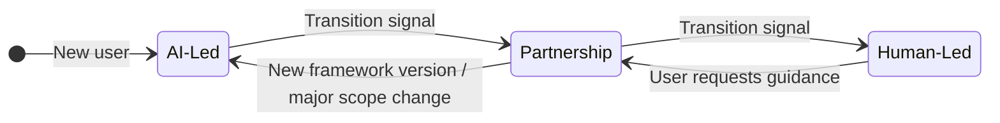
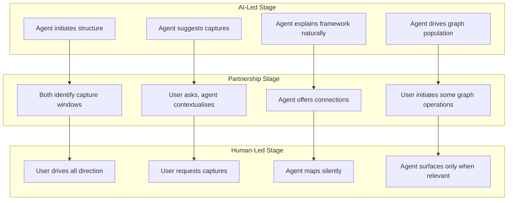
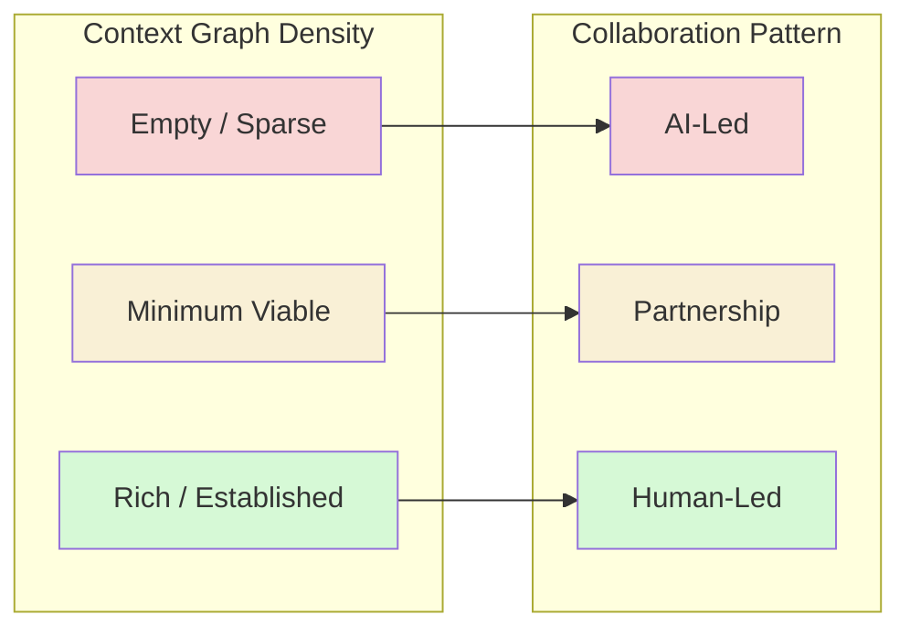
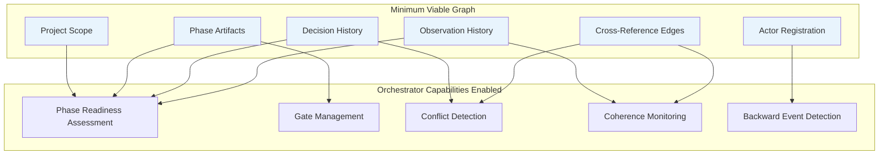
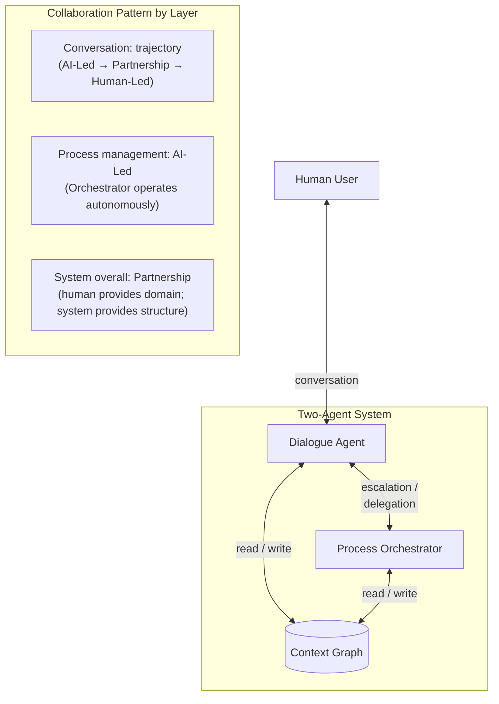

# Concept: Collaboration Pattern Trajectory

## Context

The Five Collaboration Patterns (concept_collaboration-patterns.md) describe how human and AI actors work together, ranging from Human-Only through Partnership to AI-Only. These patterns were originally designed for capability instances within SDLC activities — selecting a pattern based on knowledge composition, capability requirements, and actor strengths.

The Two-Agent Architecture (THY-005) introduced a structural separation: the Dialogue Agent faces the human while the Process Orchestrator manages process internally. This separation revealed a tension: the Dialogue Agent was assigned a fixed Human-Led collaboration pattern, but its actual cognitive contribution — silent graph mapping, capture window recognition, autonomous delegation — exceeds that pattern's definition.

This document explores the insight that the Dialogue Agent's collaboration pattern is not fixed. It follows a **trajectory** that shifts as the user gains framework competency, and the context graph itself provides the structural signal for transitions.

## The Tension: Fixed Pattern vs Dynamic Reality

### What the Dialogue Agent Actually Does

| Activity | Pattern It Resembles | Why |
|----------|---------------------|-----|
| Following the human's conversational thread | Human-Led | Human drives; agent follows |
| Silently mapping dialogue to context graph | Partnership | Autonomous pattern recognition |
| Recognising capture windows | Partnership | Independent judgement about significance |
| Delegating to Process Orchestrator | AI-Led | Autonomous process management decisions |
| Translating structured escalations | Partnership | Deciding what to surface and how |
| Guiding new users through graph population | AI-Led | Agent leads; human provides content |

A single fixed pattern cannot describe this range. The agent's collaboration pattern depends on what it is doing and — critically — on the user's familiarity with the framework.

## The Collaboration Trajectory

### Core Insight

The Dialogue Agent's collaboration pattern follows a trajectory that mirrors progressive disclosure but extends it from vocabulary to leadership:

| Stage | Agent Behaviour | User State | Duration |
|-------|----------------|------------|----------|
| **AI-Led** (onboarding) | Guides context graph population; suggests what to capture; structures initial framework setup | Learning the framework; doesn't yet know what to drive toward | Sessions to weeks |
| **Partnership** (growing competency) | Both contribute; agent offers structural awareness while user provides domain knowledge and direction | Understands key concepts; initiates some captures; asks purposeful questions | Weeks to ongoing |
| **Human-Led** (established) | Follows human's thread; offers capture; manages process silently | Drives confidently; uses framework vocabulary naturally; knows what to log | Ongoing steady state |

### What Changes at Each Stage

### Progressive Disclosure Alignment

The collaboration trajectory aligns with progressive disclosure — they are the same curve applied to different dimensions:

| Dimension | AI-Led (Onboarding) | Partnership (Growing) | Human-Led (Established) |
|-----------|---------------------|----------------------|------------------------|
| **Vocabulary** | No framework terms | Named when user demonstrates understanding | Full framework language |
| **Leadership** | Agent guides and structures | Both contribute direction | Human drives entirely |
| **Capture** | Agent suggests what to capture | Both recognise capture windows | User initiates; agent offers |
| **Process** | Agent explains process naturally | Agent surfaces process when relevant | Process is invisible infrastructure |
| **Graph operations** | Agent-initiated with explanation | Collaborative; user understands the graph | User-directed; agent maps silently |

## Context Graph as Transition Signal

### The Problem with Heuristic Signals

Soft signals for collaboration stage transitions — vocabulary adoption, reduced question-asking, user-initiated captures — are useful but imprecise. They require the agent to make subjective judgements about user competency.

### The Structural Signal

The context graph provides an objective, structural transition signal. If we define the **minimum viable graph** required for the Process Orchestrator to function, then:

1. **Graph below minimum** → AI-Led mode is appropriate (onboarding: populate the graph)
2. **Graph at minimum** → Partnership is appropriate (user has demonstrated competency by completing population)
3. **Graph well-established** → Human-Led is appropriate (user drives; framework is operational infrastructure)

### Minimum Viable Context Graph

For the Process Orchestrator to meaningfully orchestrate a build cycle, the context graph requires at minimum:

| Element | Why Required | Populated During |
|---------|-------------|-----------------|
| **Project scope definition** | Orchestrator needs to know what phases apply | Early onboarding |
| **At least one phase with artifacts** | Orchestrator needs state to assess | Onboarding through first work cycle |
| **Decision history** (2+ decisions logged) | Orchestrator needs decision coverage for readiness | Onboarding as user learns to capture |
| **Observation history** (2+ observations) | Orchestrator needs freshness data | Onboarding as user learns to observe |
| **At least one cross-reference edge** | Orchestrator needs graph connectivity for conflict detection | As user connects topics |
| **Actor registration** | Orchestrator needs to know who is working | Automatic at session start |

This is not arbitrary — each element maps to a specific Orchestrator capability:

### Onboarding as Graph Population

In AI-Led mode, the Dialogue Agent's goal is concrete and finite: guide the user through populating the minimum viable graph. This gives onboarding:

- **A clear end point**: The graph reaches minimum viability
- **A natural learning path**: The user learns the framework by doing the work that makes it operational
- **A built-in competency demonstration**: Completing the population proves the user understands capture, decisions, observations, and connections
- **A structural transition trigger**: No subjective judgement needed — the graph tells you when to shift

## System-Level Collaboration View

The two-agent *system* has its own collaboration characteristics that differ from either individual agent:

| Layer | Pattern | Rationale |
|-------|---------|-----------|
| **Conversation** (user ↔ Dialogue Agent) | Trajectory (AI-Led → Human-Led) | Shifts as user gains competency |
| **Process** (Orchestrator internally) | AI-Led with escalation | Orchestrator operates autonomously; escalates for human judgement |
| **System** (user ↔ both agents as a whole) | Partnership | Human provides domain knowledge and decisions; system provides structural awareness and process management |

## Implications

### For the Dialogue Agent Specification

The agent spec should encode the trajectory, not a fixed pattern. This means:
- Defining behavioural descriptions for each stage (AI-Led, Partnership, Human-Led)
- Specifying how the agent assesses which stage is current
- Describing transition behaviours (how to shift smoothly)

### For the Collaboration Patterns Concept

The collaboration patterns concept already notes that "the boundary between patterns is dynamic, not fixed" (in the Automation Boundary Dynamics section). The trajectory extends this: patterns can be dynamic not just across capability instances, but within a single agent's relationship with a user over time.

### For the Process Orchestrator

The Orchestrator's minimum graph requirements become a first-class schema — not just an internal prerequisite but the structural definition of "framework readiness" that drives the onboarding experience.

### For Onboarding Design

Onboarding is no longer a separate concern layered on top of the framework. It *is* the AI-Led stage of the collaboration trajectory, with context graph population as its concrete curriculum.

## Open Questions

1. **Transition smoothness**: How does the agent avoid jarring shifts? Likely gradual — start reducing guidance before fully shifting pattern.
2. **Regression handling**: What happens when a user returns after a long absence? The graph is still populated but the user may have lost familiarity. May need soft signals alongside structural ones.
3. **Multi-user divergence**: Different users on the same project may be at different trajectory stages. Per-user collaboration stage tracking needed.
4. **Minimum graph schema**: Exact specification of the minimum viable graph needs detailed design.

## Related Documents

- [Five Collaboration Patterns](./concept_collaboration-patterns.md) — the pattern definitions this document extends
- [THY-005: Two-Agent Architecture](../implementation/theory_two-agent-architecture.md) — the architectural separation that surfaced the trajectory insight
- [THY-004: Non-Linear Cognition](../implementation/theory_non-linear-cognition.md) — the non-linearity tolerance that the trajectory must preserve at all stages
- [OBS-20260207-104144](../.dialogue/logs/observations/) — initial observation capturing the trajectory insight
- [OBS-20260207-104400](../.dialogue/logs/observations/) — observation on context graph requirements as onboarding driver

---

*This document captures emerging thinking from the February 2026 design session on how the Dialogue Agent's collaboration pattern should evolve dynamically as users gain framework competency, using context graph density as the structural transition signal.*
