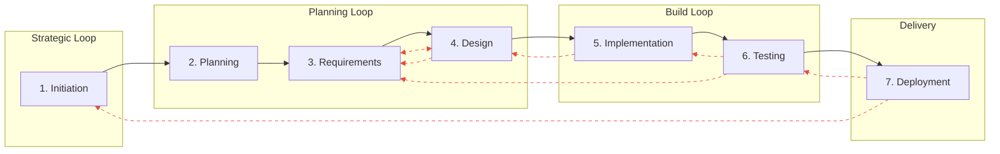

# Key Reference Concept 4: Seven-Phase SDLC Model

## Definition

The Seven-Phase Software Development Lifecycle model identifies seven fundamental types of work that occur in all software development regardless of methodology: understanding why development is undertaken (Initiation/Conception), planning how to execute (Planning), specifying what to build (Analysis/Requirements), designing structure (Design/Architecture), building the system (Implementation/Construction), confirming correctness (Testing/Validation), and delivering value (Deployment/Operations). This model consolidates the thirty processes in ISO/IEC/IEEE 12207:2017 into practical phases while preserving critical distinctions—particularly the separation of Initiation from Planning that captures strategic "why" information often lost in simpler models. The seven phases are methodology-independent: whether organisations use Waterfall (sequential execution), Agile (compressed sprints), DevOps (continuous flow), or hybrid approaches, these same seven types of work occur. The methodology determines when and how phases execute, not whether they exist.

## The Seven Phases

| Phase | Primary Focus | ISO/IEC/IEEE 12207:2017 Processes | Key Outputs |
|-------|--------------|-----------------------------------|-------------|
| **1. Initiation/Conception** | Why: Business case, opportunity framing, stakeholder alignment, strategic rationale | Business or Mission Analysis, Stakeholder Needs Definition | Business case, feasibility assessment, stakeholder identification, project charter |
| **2. Planning** | How: Project organisation, resource allocation, risk management, governance structure | Project Planning, Decision Management, Risk Management | Project plan, resource allocations, risk register, governance structure |
| **3. Analysis/Requirements** | What: Transform stakeholder needs into formal specifications | Stakeholder Requirements Definition, System Requirements Definition, Software Requirements Definition | Requirements specifications, use cases, acceptance criteria, traceability matrices |
| **4. Design/Architecture** | Structure: How system will be organised to satisfy requirements | Architecture Definition, Design Definition, System Analysis | Architecture documents, design specifications, interface definitions, ADRs |
| **5. Implementation/Construction** | Build: Create actual system components and integrate them | Implementation, Integration, Configuration Management | Source code, unit tests, build artifacts, API documentation |
| **6. Testing/Validation** | Correctness: Verify implementation and validate stakeholder needs met | Verification, Validation, Quality Assurance | Test plans, test results, defect logs, validated system |
| **7. Deployment/Operations** | Value delivery: Deploy, operate, maintain, evolve, retire | Transition, Operation, Maintenance, Disposal | Deployment documentation, operational runbooks, maintenance logs, incident reports |

## Why Seven Phases: The Critical Initiation Separation

The model's key differentiator from simpler five- or six-phase models is explicitly separating Initiation/Conception from Planning. Many models consolidate these, treating project initiation as part of project planning. However, this loses critical information about strategic "why" that research shows is essential for success.

**What Initiation captures that Planning doesn't**: The strategic rationale—why this problem is worth solving and this opportunity worth pursuing. Market understanding and competitive context. Stakeholder politics and organisational dynamics. Problem framing and opportunity definition—often involving redefining the problem from how initially presented. Alternatives considered and rejected, with rationale. The fundamental business case that justifies all subsequent investment.

**What gets lost when consolidated**: When Initiation merges into Planning, the strategic rationale becomes subordinate to execution details. Alternatives explored during opportunity analysis disappear from the record—we document what we're building but not what we decided not to build and why. Political context and stakeholder dynamics reduce to simple stakeholder registers missing the nuanced understanding necessary for ongoing engagement. The business case becomes a checkbox rather than a living justification guiding decisions.

**Empirical justification**: Multiple lines of evidence support early-phase importance for project outcomes. PMI's Pulse of the Profession found poor communication contributes to 56% of failed projects—and communication failures frequently originate in early phases where shared understanding must be established. Curtis et al.'s (1988) field study of 17 large projects identified "thin spread of application domain knowledge" as a critical problem. When teams don't truly understand why they're building something, they cannot elicit appropriate requirements. When stakeholders aren't genuinely aligned on purpose, requirements become political rather than technical. When the business case is weak, projects continue despite lack of value.

**Information composition rationale**: Initiation exhibits the highest tacit and emergent knowledge content of any phase. This makes it both the most critical for human leadership and the phase where information loss is greatest. Separating it from Planning maintains visibility and enables specific mitigation strategies.

## Methodology Independence

The seven phases describe types of work, not execution patterns. How phases execute varies dramatically across methodologies:

**Waterfall (Sequential)**: Phases execute in strict sequence with formal gates. Initiation completes before Planning begins. Requirements fully specified before Design starts. Comprehensive documentation at each gate. Limited iteration between phases.

**Agile (Iterative)**: All seven phases compress into 1-4 week sprints. Each sprint involves initiation (why this feature), planning (sprint planning), requirements (story refinement), design (technical design), implementation (coding), testing (continuous testing), and deployment (sprint deployment). Phases cycle rapidly rather than executing once.

**DevOps (Continuous)**: Phases blur into continuous flow. Deployment occurs continuously rather than as distinct phase. Testing integrates throughout implementation. Requirements emerge from production feedback. Phase boundaries become indistinct.

**Hybrid (Adaptive)**: Different phases follow different patterns. Early phases (Initiation, Planning, Requirements) execute sequentially to establish foundation. Later phases (Design, Implementation, Testing) proceed iteratively with continuous deployment.

Regardless of pattern, all seven work types occur. The most rapid Agile team still performs initiation work (understanding feature value), planning work (sprint planning), requirements work (refinement), design work (technical design), implementation work (coding), testing work (verification), and deployment work (release).

## Phase Dynamics: States, Events, and Information Flow

The seven phases are best understood not as discrete time periods but as **states** in an information processing system. Each phase (or capability instance within a phase) acts as a **processor** that receives information, transforms it using capabilities, and produces outputs that become inputs to subsequent processing.

**Phase transitions occur when:**
1. **Sufficient information is received** by the processing actor—the normal case where downstream phases have what they need, OR
2. **An actor decides to proceed at risk** despite insufficient information—creating **information debt**

### Information Debt

When actors proceed with transitions before information is sufficient, they create information debt analogous to technical debt:

| Aspect | Technical Debt | Information Debt |
|--------|----------------|------------------|
| **Creation** | Shortcuts in implementation | Proceeding without sufficient understanding |
| **Accumulation** | Interest compounds over time | Missing understanding causes downstream problems |
| **Manifestation** | Harder to modify, more defects | Backward events, rework, quality issues |
| **Payment** | Refactoring, rewriting | Discovery, rework, sometimes project failure |

Information debt manifests as:
- **Backward events**: Gaps discovered later trigger revisiting earlier phases
- **Quality issues**: Defects from building on incomplete understanding
- **Technical debt**: Implementations that fight unstated constraints (information debt *creates* technical debt)
- **Transition loss amplification**: Already-severe transition losses worsen when proceeding at risk

Proceeding at risk is sometimes necessary (time pressure, learning through doing, acceptable uncertainty), but should be a conscious decision with understood consequences, not an accidental default.

### Transition Sufficiency

**"Sufficient information" for a transition is not prescribed but discovered.** Each organisation, team, and project has different risk tolerances and rework costs. What constitutes "enough" to proceed depends on:

- **Organisational risk appetite**: Some organisations accept higher uncertainty; others require more certainty
- **Rework costs**: If downstream rework is cheap, proceeding earlier is reasonable; if expensive, waiting for more information is prudent
- **Learning strategy**: Sometimes proceeding at risk is deliberate—learning through doing when analysis would take longer than experimentation
- **Deadline pressure**: Fixed deadlines may force proceeding at risk regardless of information state
- **Stakeholder alignment**: Formal sufficiency may be less important than stakeholder consensus

**AI's role is to help humans articulate their sufficiency criteria** through targeted questions:
- "What would make you confident enough to proceed?"
- "What's the cost of waiting for more information vs. proceeding now?"
- "What risks are you comfortable carrying forward vs. resolving now?"
- "If you proceed at risk, how will you detect accumulating debt?"

This makes transition decisions **conscious and contextual** rather than defaulting to either premature progression or analysis paralysis.

### Complementary Views of Phase Execution

| View | What It Shows | When It's Useful |
|------|---------------|------------------|
| **Linear** | The "happy path"—sequential progression through phases | High-level planning, stakeholder communication, milestone tracking |
| **Loop-based** | Expected iteration patterns between phases | Process design, resource planning, understanding common rework |
| **Event-driven** | Actual dynamics—why transitions happen when they do | Understanding behaviour, designing interventions, root cause analysis |

All three views are correct at different levels of abstraction. The linear view is a useful simplification. The loop view shows common patterns. The event view reveals mechanism.

### Phase Span and Overlap

Phases have **start points** and **end points** that can overlap significantly:

```
Timeline:     ─────────────────────────────────────────────────────────►

Initiation:   [■■■■■■]
Planning:        [■■■■■■■■■■■■■■■■■■■■■■■■■■■■■■■■■■]
Requirements:        [■■■■■■■■■■■■■■■■]
Design:                   [■■■■■■■■■■■■■■■■]
Implementation:                       [■■■■■■■■■■■■■■■■■■]
Testing:                                  [■■■■■■■■■■■■■■■]
Deployment:                                           [■■■■■■■]
```

**Key observations:**
- **Planning spans most of the project**—starts early but cannot complete until Design provides sufficient detail for realistic estimates
- **Requirements and Design overlap significantly**—they inform each other iteratively
- **Testing starts before Implementation ends**—continuous verification, TDD
- **Initiation is concentrated early**—but its outputs inform all subsequent phases

This overlap explains why information composition within a phase may shift as the phase progresses.

### Common Phase Loops

While linear progression represents the "happy path", software development routinely involves feedback loops between phases. These loops are not failures—they reflect legitimate learning and course correction:



**Common Loop Patterns:**

| Loop | Phases | Trigger | Frequency |
|------|--------|---------|-----------|
| **Requirements-Design** | 3 ↔ 4 | Design reveals requirement gaps or conflicts | Very common |
| **Design-Implementation** | 4 ← 5 | Build discovers technical constraints | Common |
| **Implementation-Testing** | 5 ↔ 6 | Tests fail, fixes verified | Continuous (TDD) |
| **Testing-Requirements** | 3 ← 6 | Acceptance criteria mismatch | Occasional |
| **Deployment-Testing** | 6 ← 7 | Production issues require fixes | As needed |
| **Strategic Reset** | 1 ← any | Market shift, stakeholder change | Rare but significant |

**Loop Characteristics:**

- **Short loops** (adjacent phases, e.g., 5↔6): Low cost, expected, often continuous
- **Medium loops** (2-3 phases back, e.g., 6→3): Moderate cost, indicates earlier gaps
- **Long loops** (to Phase 1): High cost, strategic reassessment, may reset project

**Information Debt and Loop Length:**

Proceeding at risk (with information debt) tends to produce longer loops:
- Inadequate Phase 1 → discovered in Phase 5/6 → expensive reset
- Thorough Phase 1 → issues found in Phase 3/4 → shorter, cheaper correction

This explains why early phases, despite being "further" from delivery, have outsized impact on project success.

### Event Taxonomy

**Forward Events (Progress Triggers):**

These occur when sufficient information has been received (normal transition) or when an actor decides to proceed at risk:

| Event | From Phase | To Phase | Information Trigger |
|-------|------------|----------|---------------------|
| `OPPORTUNITY_VALIDATED` | Initiation | Planning | Stakeholders aligned, business case accepted |
| `SCOPE_BOUNDED` | Planning | Requirements | Resources allocated, timeline agreed, risks identified |
| `NEEDS_FORMALISED` | Requirements | Design | Requirements stable enough to design against |
| `ARCHITECTURE_STABLE` | Design | Implementation | Design decisions made, interfaces defined |
| `CODE_COMPLETE` | Implementation | Testing | Features implemented, unit tests pass |
| `QUALITY_SUFFICIENT` | Testing | Deployment | Acceptance criteria met |
| `DEPLOYED` | Deployment | Operations | System live, handover complete |

**Backward Events (Revisit Triggers):**

These often indicate information debt being "called in"—gaps discovered that should have been addressed earlier:

| Event | From Phase | To Phase | Information Trigger |
|-------|------------|----------|---------------------|
| `SCOPE_CHANGE` | Any | Initiation | Strategic shift, new stakeholder, market change |
| `ESTIMATE_INVALID` | Requirements/Design | Planning | Discovered complexity invalidates plan |
| `REQUIREMENT_MISSED` | Design/Implementation | Requirements | Gap discovered during design or build |
| `DESIGN_FLAW` | Implementation/Testing | Design | Technical constraint discovered |
| `INTEGRATION_FAILURE` | Testing | Implementation | Components don't work together |
| `ACCEPTANCE_REJECTED` | Deployment | Testing/Requirements | Stakeholder says "this isn't what I meant" |
| `PRODUCTION_ISSUE` | Operations | Any | Bug, performance, or usability problem in production |

### Information Types and Event Triggers

Events are triggered by **information discoveries**, and the information type influences event character:

| Information Type | Event Character | Example |
|------------------|-----------------|---------|
| **Formal** | Measurable, unambiguous, often automated | "Tests fail" → `QUALITY_INSUFFICIENT` |
| **Tacit** | Judgement-based, requires human interpretation | "This design feels wrong" → investigation → `DESIGN_FLAW` |
| **Emergent** | Arises from interaction, often unexpected | "We never considered this scenario" → `REQUIREMENT_MISSED` |

**Key insight**: Tacit and emergent discoveries often trigger **backward** events (revisiting earlier phases). Formal discoveries can trigger movement in either direction. This explains why early phases—which are tacit-heavy—are more likely to cause later rework when inadequately executed.

### Retrograde Navigation: Backward Events as Valid Process Outcomes

The backward event taxonomy above documents *what* triggers revisitation. This section addresses *how* the framework supports navigating retrograde steps as legitimate process outcomes, not failures to be minimised.

#### Phases as Character, Not Location

A common misinterpretation treats phases as locations in a linear journey—once "in Phase 4", earlier phases are "behind" and returning represents regression. This framing causes problems:

- **Change control friction**: Returning to earlier work requires justification, approval, process overhead
- **Sunk cost bias**: Investment in later-phase work creates pressure to proceed despite flawed foundations
- **Context loss**: By the time a retrograde step is acknowledged, the original phase context has decayed

The framework reframes phases as **character** rather than **location**:

| Interpretation | Linear Model | Character Model |
|----------------|--------------|-----------------|
| `phase: 1` on a task | "We are in Phase 1" | "This work has Phase 1 character (tacit-heavy, stakeholder-focused)" |
| Phase transition | "Done with Phase 1, moving to Phase 2" | "Phase 1 outputs exist; may be revisited based on later learning" |
| Backward event | Regression requiring justification | Valid process outcome—new information invalidates earlier understanding |
| Phase completion | "Phase 1 closed" | "Phase 1 outputs are current best understanding" |

**Key insight**: A task's phase tag describes the *type of work* being done, not where the project "is" in a lifecycle. Multiple phases can have active work simultaneously.

#### Emergent Information and Retrograde Triggers

Emergent information—understanding that arises from doing the work—is the primary trigger for legitimate retrograde steps:

| Discovery Phase | Retrograde Target | Example |
|-----------------|-------------------|---------|
| Design (4) | Requirements (3) | "This constraint wasn't in requirements but is essential" |
| Implementation (5) | Design (4) | "The architecture can't support this data volume" |
| Testing (6) | Requirements (3) | "The acceptance criteria don't match stakeholder intent" |
| Deployment (7) | Initiation (1) | "The problem we solved isn't the problem users have" |

These discoveries are **not failures**—they're the natural result of gaining understanding through work. The framework's information composition model *predicts* this: emergent knowledge (10-20% of each phase) cannot be known until work is undertaken.

**The question isn't whether retrograde steps occur, but whether the framework helps navigate them effectively.**

#### Navigation vs Tracing

**Tracing** answers: "What happened? How did we get here?"
- Decision logs show what was decided and why
- Observation logs show what was discovered
- task history shows progression

**Navigation** answers: "What should we do now? What's affected?"
- Which earlier decisions depend on the invalidated understanding?
- Which later work depends on those decisions?
- What's the cost of revision vs proceeding at risk?

The framework should support both. Tracing through logging; navigation through:

1. **Ripple identification**: Given new information, what earlier outputs are potentially affected?
2. **Dependency surfacing**: What later work depends on those outputs?
3. **Cost visibility**: What's the revision cost vs the cost of proceeding with known gaps?
4. **Context restoration**: What was understood when the earlier decision was made?

#### Preventing Retrograde Loops

Legitimate concern: If retrograde steps are normalised, progress could stall in endless revisitation.

**Natural constraints:**
- Each revisitation *should* incorporate new understanding—cycling without learning indicates a deeper problem
- Later-phase work depends on earlier outputs—revision has real costs that create natural friction
- Stakeholders expect progress—repeated returns to Initiation will surface alignment problems

**Framework mechanisms:**
- **Confidence markers**: Decisions can be marked "provisional—revisit if X" vs "committed—revision is expensive"
- **Ripple cost visibility**: Before revisiting, surface what depends on this output
- **Convergence tracking**: If the same phase is revisited repeatedly without resolution, that's a signal worth investigating

#### Implications for Tooling and Session Design

Recognising retrograde steps as valid process outcomes has implications for how tooling presents project state:

**Session continuity should be phase-independent:**
```
Project: [Name]
Recent activity:
- FW-008: Orchestrator research (Phase 1 character)
- SH-009: Capability flows (Phase 3 character)
- Recent decisions: [list]

What would you like to work on?
```

**Not:**
```
You are currently in Phase 3. Continue with requirements work?
```

The session presents what work exists and its character. The human decides what to work on—which might be returning to Phase 1 work based on Phase 5 discoveries.

**Decision context preservation becomes critical:**
When navigating a retrograde step, the human needs to understand what was known when the earlier decision was made. The `context` field in decision logs serves this purpose—it captures *what we knew when we decided*, enabling intelligent revisitation.

### Implications of the Event-Driven Model

**For process design:**
- Define clear **forward event criteria** (when is a phase "done enough" to progress?)
- Anticipate **backward event triggers** (what discoveries would require revisiting earlier work?)
- Design **information checkpoints** that surface issues early
- **Treat retrograde steps as valid outcomes**—design process to navigate them, not prevent them

**For AI augmentation:**
- AI can **detect potential events** (patterns in data, inconsistencies, quality metrics)
- AI can **alert humans** to potential triggers before they become blocking
- Humans **decide responses** to events (forward, backward, investigate further)
- AI can **surface ripple effects** when backward events are identified
- AI can **restore context** from decision/observation logs when revisiting earlier work

**For estimation and planning:**
- Acknowledge that **Planning spans most of the project** and refines iteratively
- Build in **contingency for backward events**, especially from tacit/emergent discoveries
- Avoid treating early-phase outputs as fixed inputs to later phases
- **Budget for retrograde navigation**—it's not rework, it's incorporating learning

## Key Implications

**For phase-specific reasoning**: Each phase has characteristic information composition, appropriate automation levels, typical failure modes, and required capabilities. Understanding phase boundaries enables targeted strategies rather than one-size-fits-all approaches.

**For information architecture**: Different phases produce and consume different information types. Early phases are tacit-heavy, requiring extensive social learning and mentoring. Later phases are formal-heavy, enabling automation and quantitative measurement. The progression explains why documentation strategies must vary.

**For measurement framework design**: Different phases need different measurement approaches based on their information composition. Tacit-heavy early phases require qualitative assessment of stakeholder alignment and shared understanding. Formal-heavy later phases support quantitative metrics like defect density and test coverage.

**For understanding failure patterns**: Each phase has characteristic failure modes traced to its information composition. Initiation failures stem from inadequate problem framing and stakeholder misalignment. Requirements failures stem from incomplete tacit knowledge transfer. Implementation failures stem from design understanding loss. Deployment failures stem from operational knowledge gaps.

**For human-AI collaboration design**: Phase characteristics determine appropriate collaboration patterns. Tacit-heavy early phases require human leadership with AI support. Formal-heavy later phases enable AI leadership with human oversight. The seven-phase structure provides scaffolding for systematic collaboration design across the lifecycle.

## Integration with Other Concepts

- [**Information Composition Taxonomy**](./concept_information-taxonomy.md): Each phase has characteristic formal/tacit/emergent composition (specified in Concept 6), explaining why approaches must vary. Information type also influences which events trigger phase transitions.
- [**Theory-Building Principle**](./foundation_theory-building.md): Theory building occurs throughout lifecycle—early phases build theory about problem space, middle phases about solution structure, later phases about implementation details. Backward events often indicate theory revision is needed.
- [**Eight-Capability Taxonomy**](./concept_capability-model.md): Different phases emphasise different capabilities—early phases emphasise Elicit/Synthesise/Decide, later phases emphasise Transform/Generate/Validate. Capabilities also enable event detection (Validate capability detects quality events).
- [**Actor Model**](./concept_actor-model.md): Phase characteristics determine appropriate actor participation—tacit-heavy phases need human actors, formal-heavy phases enable AI actors. AI can detect formal events; humans interpret tacit/emergent discoveries.
- [**Five Collaboration Patterns**](./concept_collaboration-patterns.md): Patterns shift systematically across phases from Human-Only/Human-Led early to Partnership/AI-Led later. Pattern selection should also consider event response—backward events often require human-led investigation.
- [**Phase-Specific Information Composition**](./integration_phase-specific-composition.md): Concept 6 provides specific percentage estimates for each phase's formal/tacit/emergent composition. Note that composition may shift within a phase as it progresses (especially for long-spanning phases like Planning).
- [**Information Loss at Transitions**](./concept_transitions-info-loss.md): Each phase boundary (Concept 8) represents potential information loss, with different transitions having different loss patterns. The event model clarifies that transitions are triggered by information discoveries, and loss occurs when events are not properly communicated.
- [**Phase-Aware Measurement**](./concept_phase-aware-measurement.md): Concept 9 uses phase structure to argue for phase-specific measurement rather than universal metrics. Event frequency and type provide additional measurement dimensions.

## Evidence Base

ISO/IEC/IEEE 12207:2017 provides internationally recognised foundation through decades of consensus-building across industry, academia, and government. The thirty processes map cleanly to seven phases without loss or contradiction. Research across lifecycle models (PMBOK, BABOK, ITIL, various Agile methodologies) shows convergence on 5-7 core phases regardless of terminology or execution pattern.

Multiple lines of evidence support early-phase importance for project outcomes:

- **PMI Pulse of the Profession**: Poor communication contributes to 56% of failed projects; communication failures frequently originate in early phases where shared understanding must be established
- **Curtis et al. (1988)**: Field study of 17 large projects identified "thin spread of application domain knowledge" as a critical problem, highlighting how knowledge deficits in early phases propagate forward
- **Turnover studies**: Knowledge loss precedes productivity decline (Rigby et al., 2016); teams with high turnover accumulate 37% more technical debt (LinearB, 2024)
- **Team Tacit Knowledge**: r=0.35 correlation with team effectiveness using validated instrument (Ryan & O'Connor, 2013)
- **Logical dependency**: Later phases structurally depend on earlier phases; deficiencies in problem framing and requirements cascade into design and implementation

Research on information types validates the shift from tacit-heavy early phases to formal-heavy later phases. The methodology independence claim is validated through observation that all methodologies perform these work types, with systematic comparative research quantifying how execution patterns affect outcomes.

## Validation Status

- ✓ **Standards grounding**: Maps completely to ISO/IEC/IEEE 12207:2017 with full traceability
- ✓ **Convergence across frameworks**: All examined frameworks recognise these work types even with different terminology
- ✓ **Failure research correlation**: Early phase inadequacy predicts poor outcomes across multiple independent studies (PMI, Curtis et al., turnover research)
- ✓ **Methodology independence**: Validated through observation that all methodologies perform these work types
- ⚠ **Benefits of Initiation separation**: Supported by failure research but lacks controlled comparison studies
- ⚠ **Information composition shift**: Directionally validated but specific percentages (Concept 6) require measurement studies
- ⚠ **Optimal phase granularity**: Seven phases is practical but whether different granularity would be better requires comparative validation
- ⚠ **Phase overlap model**: Logically derived from methodology independence observation; requires empirical validation of typical span patterns
- ⚠ **Event taxonomy**: Derived from practitioner experience and failure analysis; specific event categories need validation across organisational contexts
- ⚠ **Information-event correlation**: Hypothesis that tacit/emergent discoveries trigger backward events more frequently requires systematic study
- ⚠ **Retrograde navigation**: Conceptually derived from emergent information model; needs validation that navigation support improves outcomes vs tracing alone
- ⚠ **Phase-as-character framing**: Reframe of linear model; requires practitioner feedback on whether this improves process design

---

*The Seven-Phase SDLC Model provides the structural foundation enabling all phase-specific reasoning in the framework. The phases represent types of work, not discrete time periods—they overlap, iterate, and respond to information events throughout development. Understanding what work occurs in each phase, how phases interact dynamically, and how information discoveries trigger transitions enables principled decisions about documentation, automation, measurement, and collaboration throughout software development.*

---

## Document History

**Version 2.1** (January 2026)
- Added "Common Phase Loops" section with Mermaid diagram
- Documented loop patterns, characteristics, and relationship to information debt

**Version 2.0** (January 2026)
- Added "Retrograde Navigation" section addressing backward events as valid process outcomes
- Introduced "phases as character, not location" framing
- Added navigation vs tracing distinction
- Extended implications for tooling and session design
- Updated Validation Status with retrograde navigation items

**Version 1.0** (November 2025)
- Initial seven-phase model with methodology independence
- Phase dynamics: states, events, information flow
- Information debt concept
- Event taxonomy (forward and backward events)
